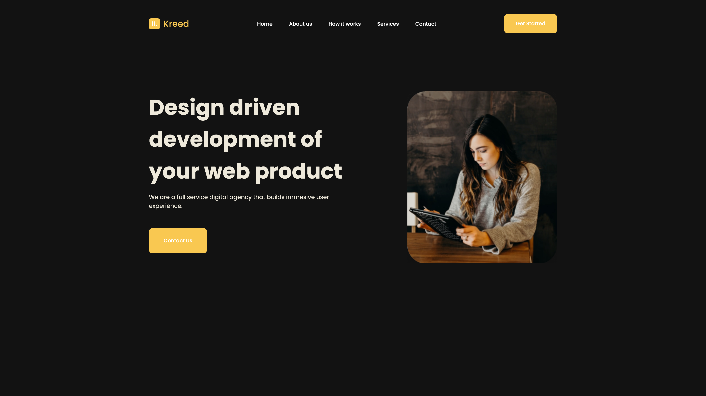

<p align="center" >

</p>  

# Kreed - A Digital Agency

Landing page for Kreed created with TypeScript, Styled Components, ReactJS and Atomic Design Pattern.

The main goal of this project was to deepen my studies in Atomic Design Pattern.

<br> <hr> <br>

## Screenshot



<br> <hr> <br>

## Installation

Clone the project

```bash
  git clone https://github.com/GersonRocha9/01.hero.git
```

Go to the project directory

```bash
  cd 01.hero
```

Install dependencies

```bash
  yarn
```

Start the server

```bash
  yarn dev
```

<br> <hr> <br>


## 🔗 Links
[](https://www.linkedin.com/in/gersonrocha/)


